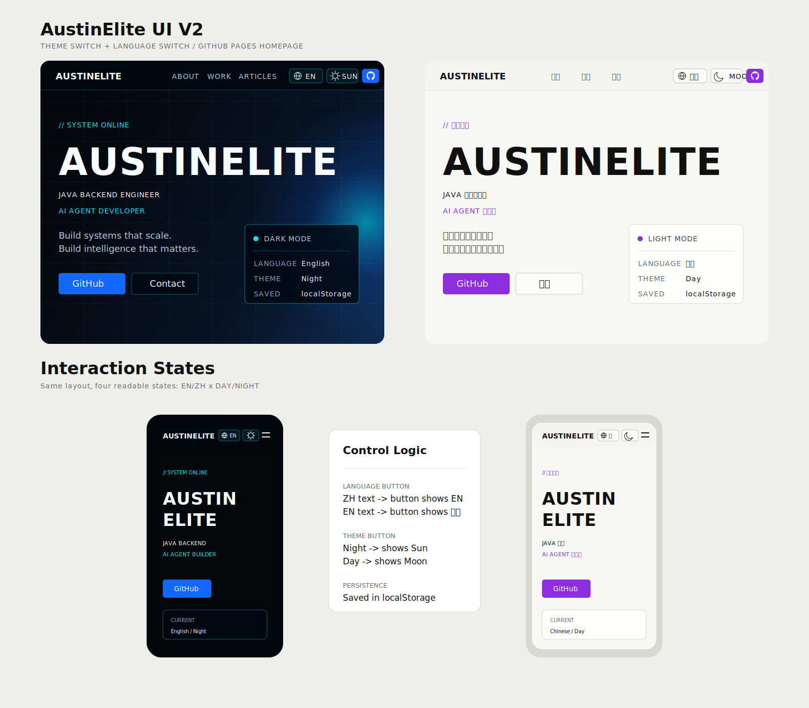
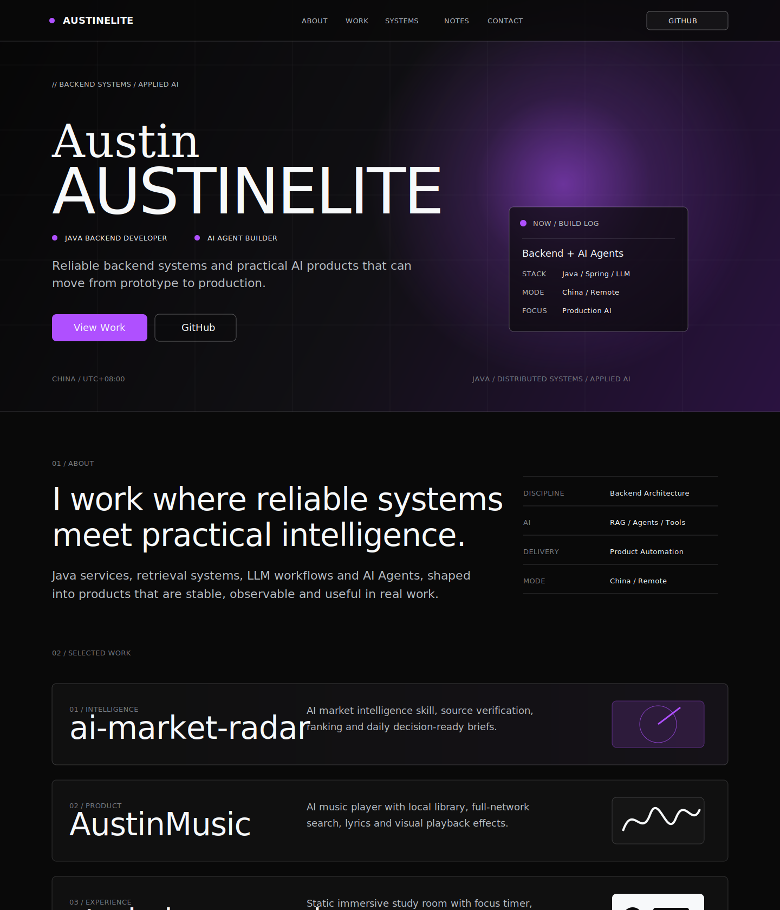
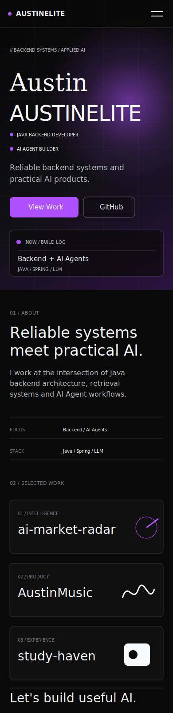
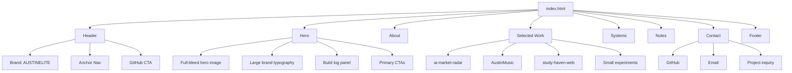

# AustinElite 个人主页实施方案与 UI 图

资料基准日期：2026-07-12  
目标站点名称：AustinElite  
目标发布地址：https://austinelite.github.io/  
目标仓库：`AustinElite/AustinElite.github.io`

## 1. 项目目标

为 GitHub Pages 制作一个可直接上线的个人主页 `index.html`，用 AustinElite 的 GitHub 公开内容建立个人品牌：Java 后端、AI / LLM、AI Agent、自动化工具与创作者工作流。

参考站点 `https://seanobrien.com.au/` 的方向不是复制内容，而是借鉴它的视觉节奏：

- 首屏用强主视觉图承载身份，而不是普通卡片式介绍。
- 大字号个人品牌名占据第一视口。
- 导航精简，页面以分区滚动表达履历、项目和联系。
- 项目展示重视图片、真实作品状态和外链。
- 底部使用巨大品牌字标收束页面。

## 2. 已确认的公开内容

### GitHub 个人定位

GitHub 公开简介显示 Austin 是一名正在成长中的 Java 后端开发者，并深入学习 AI 与大语言模型。主页文案应围绕“后端工程 + 应用型 AI”展开，避免写成泛泛的学生作品集。

推荐主标语：

> AustinElite builds reliable backend systems and practical AI products.

中文版本：

> 构建可靠的后端系统，也构建能进入真实业务的 AI 产品。

### 重点项目映射

| 展示优先级 | 仓库 | 类型 | 页面定位 | 建议展示方式 |
|---|---|---|---|---|
| 1 | `ai-market-radar` | Python / Codex Skill | AI 情报雷达、信息核验、热点总结 | 大项目卡，雷达或情报流视觉 |
| 2 | `AustinMusic` | TypeScript / Next.js | AI 音乐播放器、检索、歌词、弹幕视觉 | 大项目卡，使用项目截图 |
| 3 | `study-haven-web` | JavaScript / Static Web | 沉浸式自习室、专注计时、本地状态 | 项目卡，强调静态部署与体验 |
| 4 | `wechat-skills` | Codex Skills | 公众号写作工作流与内容生产模块 | 小项目卡或实验列表 |
| 5 | `LiBai-skill` | AI Skill | 人格、美学、表达方式转为 AI Skill | 小项目卡或实验列表 |
| 6 | `AustinElite.github.io` | CSS / GitHub Pages | 个人主页本身 | 页脚或项目列表中作为 meta project |

说明：fork 仓库可以在“Learning Signals / 关注方向”里轻量出现，但主页主体应优先展示原创或明显个人参与的项目。

## 3. 信息架构

页面建议采用单页滚动结构：

1. `Hero`：AustinElite 品牌名、身份定位、GitHub / 项目 CTA、背景视觉。
2. `About`：一句长介绍 + 关键事实，如 Java、Spring、LLM、AI Agent、China / Remote。
3. `Selected Work`：3 个大项目卡，首选 `ai-market-radar`、`AustinMusic`、`study-haven-web`。
4. `Systems`：能力条目，后端工程、AI Agent、检索增强、内容自动化。
5. `Notes / Writing`：技术文章入口，若当前文章内容不足，可先放 3 条计划主题。
6. `Contact`：GitHub、Email、项目合作入口。
7. `Footer`：超大 `AUSTINELITE` 字标 + 版权信息。

## 4. 视觉设计规范

### 设计关键词

- Editorial：像个人官方网站，不像后台管理面板。
- Minimal：减少装饰，使用留白和排版建立高级感。
- Technical：保留代码、Agent、系统构建的气质。
- Photographic：首屏必须有真实或生成的位图主视觉。

### 色彩

| 用途 | 建议色值 | 说明 |
|---|---:|---|
| 背景黑 | `#090909` | 参考站点的深色质感 |
| 主文字 | `#f7f9fa` | 高对比但不过白 |
| 次级文字 | `#b9bec5` | 用于说明文字 |
| 线条 | `rgba(247,249,250,.16)` | 轻边界 |
| 强调色 | `#af50ff` | 少量用于状态点、按钮、项目编号 |
| 反色区背景 | `#f7f9fa` | 联系区可用浅底形成节奏 |

### 字体

优先使用仓库已有字体资源：

- 标题 / 正文：`Space Grotesk`
- 代码 / 标签：`IBM Plex Mono`
- 可选签名式文字：系统 serif 字体，营造参考站点里的个人感

### 页面节奏

- 首屏高度：桌面约 `calc(100svh - 70px)`，移动端不低于 `680px`。
- 内容宽度：`min(1200px, calc(100% - 3rem))`。
- 分区间距：桌面 `96px-144px`，移动端 `64px-88px`。
- 卡片圆角：不超过 `8px`，项目图可以 `8px`，页面大区不做浮动卡片。

## 5. 桌面端 UI 图

### 新版 UI 总览图：中英文 + 白天黑夜



这张图对应当前实现后的交互状态：桌面端展示暗色英文与亮色中文两种主要状态，移动端展示同一套切换控件在窄屏下的排列方式。顶部按钮设计为“显示下一步动作”：中文界面显示 `EN`，英文界面显示 `中文`；黑夜模式显示切换到白天的按钮，白天模式显示切换回黑夜的按钮。

控件图标语义：语言切换使用地球图标，主题切换使用太阳 / 月亮图标，GitHub 入口使用 GitHub mark。

### 桌面端高保真方向图



设计要点：

- 首屏采用全屏深色主视觉，品牌名 `AUSTINELITE` 作为第一视觉锚点。
- 右侧 `NOW / BUILD LOG` 面板用于表达当前技术方向，不做复杂仪表盘。
- `About` 区用大字号叙事文字承接首屏，增强个人品牌感。
- `Selected Work` 使用横向项目条，突出仓库名称、项目类型和视觉记忆点。

### 桌面端结构线框

```text
+--------------------------------------------------------------------------------+
| AUSTINELITE                         ABOUT  WORK  SYSTEMS  NOTES  CONTACT  GIT |
+--------------------------------------------------------------------------------+
|                                                                                |
|  // BACKEND SYSTEMS / APPLIED AI                                                |
|                                                                                |
|  Austin                                                                        |
|  AUSTINELITE                                                                   |
|                                                                                |
|  Java Backend Developer     AI Agent Builder                                    |
|  Reliable backend systems and practical AI products.                            |
|                                                                                |
|  [View Work ->] [GitHub ->]                                                     |
|                                                                                |
|                                             +-------------------------------+  |
|                                             | NOW / BUILD LOG               |  |
|                                             | Focus: Backend + AI Agents    |  |
|                                             | Stack: Java / Spring / LLM    |  |
|                                             | Mode : China / Remote         |  |
|                                             +-------------------------------+  |
|                                                                                |
|  CHINA / UTC+08                       JAVA / DISTRIBUTED SYSTEMS / AI          |
+--------------------------------------------------------------------------------+
|  01 ABOUT                                                                       |
|  I work where reliable systems meet practical intelligence.                     |
|  Facts: Backend Architecture / RAG & Agents / Product Automation                |
+--------------------------------------------------------------------------------+
|  02 SELECTED WORK                                                               |
|                                                                                |
|  ai-market-radar                         [radar / intelligence visual]         |
|  AI market intelligence skill, source verification, ranking, briefs.            |
|  Python / Codex Skill / Verification                                           |
|                                                                                |
|  AustinMusic                            [project screenshot]                   |
|  AI music player with local library, search, lyrics, visual effects.            |
|  TypeScript / Next.js / AI Agent                                               |
|                                                                                |
|  study-haven-web                        [calm study room visual]               |
|  Static immersive study room with timer, ambience, local state.                 |
+--------------------------------------------------------------------------------+
|  03 SYSTEMS                                                                     |
|  01 Backend Engineering      Java / Spring / SQL                                |
|  02 AI Agent Development     RAG / Tools / Memory                               |
|  03 Product Automation       Codex Skills / Workflows                           |
|  04 Technical Writing        WeChat / Long-form / Notes                         |
+--------------------------------------------------------------------------------+
|  04 NOTES                                                                       |
|  Latest writing or planned essays                                               |
+--------------------------------------------------------------------------------+
|  LET'S BUILD SOMETHING USEFUL.                     [GitHub] [Email]             |
+--------------------------------------------------------------------------------+
|  AUSTINELITE                                                                    |
|  2026 AustinElite. Built for GitHub Pages.                                      |
+--------------------------------------------------------------------------------+
```

## 6. 移动端 UI 图

### 移动端高保真方向图



设计要点：

- 移动端保留首屏品牌冲击力，但将角色标签改为纵向排列，避免挤压。
- `NOW / BUILD LOG` 面板下沉到首屏底部，作为身份补充信息。
- 项目卡统一为单列，项目名优先，视觉图标作为辅助识别。
- 联系区保持短句收束，适合手机端快速点击 GitHub 或邮件入口。

### 移动端结构线框

```text
+----------------------------------+
| AUSTINELITE                  ==  |
+----------------------------------+
|                                  |
| // BACKEND SYSTEMS / APPLIED AI  |
|                                  |
| Austin                           |
| AUSTINELITE                      |
|                                  |
| Java Backend Developer           |
| AI Agent Builder                 |
|                                  |
| Reliable backend systems and     |
| practical AI products.           |
|                                  |
| [View Work] [GitHub]             |
|                                  |
| +------------------------------+ |
| | NOW / BUILD LOG              | |
| | Backend + AI Agents          | |
| | Java / Spring / LLM          | |
| +------------------------------+ |
+----------------------------------+
| 01 ABOUT                         |
| Long intro paragraph             |
| Facts list                       |
+----------------------------------+
| 02 SELECTED WORK                 |
| [project image]                  |
| ai-market-radar                  |
| description + tags + link        |
|                                  |
| [project image]                  |
| AustinMusic                      |
| description + tags + link        |
+----------------------------------+
| 03 SYSTEMS                       |
| Backend Engineering              |
| AI Agent Development             |
| Product Automation               |
+----------------------------------+
| CONTACT                          |
| [GitHub] [Email]                 |
+----------------------------------+
```

## 7. 页面结构图



## 8. 推荐文件方案

### 极简 GitHub Pages 方案

适合用户只想上传一个文件：

```text
AustinElite.github.io/
  index.html
```

特点：

- CSS 写在 `<style>` 中。
- 少量交互 JS 写在 `<script>` 中。
- 主视觉可用远程图片或 CSS 渐变兜底。
- 维护简单，但图片和字体管理能力弱。

### 推荐生产方案

适合当前仓库，后期更好维护：

```text
AustinElite.github.io/
  index.html
  assets/
    css/
      main.css
    js/
      main.js
    images/
      hero.webp
    projects/
      austin-music.png
```

特点：

- 首屏和项目图片区分清晰。
- 后续可继续保留文章系统、GitHub 仓库同步和 Jekyll 文章页。
- 更适合长期个人品牌站。

## 9. 完整实现步骤

### 第 1 步：确认发布仓库

1. 打开 `https://github.com/AustinElite/AustinElite.github.io`。
2. 确认仓库名必须是 `AustinElite.github.io`。
3. 确认默认分支是 `main`。
4. 确认 `index.html` 位于仓库根目录。

### 第 2 步：整理内容

1. 主页标题：`AustinElite`。
2. SEO 标题：`AustinElite - Backend Systems & Applied AI`。
3. 描述文案：`Java backend developer building reliable systems and practical AI products.`。
4. 项目顺序：
   - `ai-market-radar`
   - `AustinMusic`
   - `study-haven-web`
   - `wechat-skills`
   - `LiBai-skill`
5. 联系入口：
   - GitHub: `https://github.com/AustinElite`
   - Email: 如果暂时不公开邮箱，可先使用 `mailto:` 占位或只保留 GitHub。

### 第 3 步：准备视觉素材

1. 首屏背景图：优先使用已有 `assets/images/austinelite-hero-night.webp`。
2. 项目图：
   - `AustinMusic` 使用已有 `assets/projects/austin-music.png`。
   - `ai-market-radar` 可使用 CSS 雷达图形或后续生成一张情报雷达图。
   - `study-haven-web` 可使用项目截图，暂时没有截图时使用沉浸式学习界面的 CSS mockup。
3. 所有图片添加宽高属性，降低布局抖动。
4. 非关键图片使用 `loading="lazy"`。

### 第 4 步：编写 HTML 语义结构

建议结构：

```html
<header class="site-header">...</header>
<main>
  <section id="home" class="hero">...</section>
  <section id="about" class="section">...</section>
  <section id="work" class="section">...</section>
  <section id="systems" class="section">...</section>
  <section id="notes" class="section">...</section>
  <section id="contact" class="contact">...</section>
</main>
<footer class="site-footer">...</footer>
```

关键要求：

- 首屏 `h1` 必须是 `AustinElite`。
- 每个分区都要有可跳转的 `id`。
- 外链添加 `target="_blank"` 和 `rel="noopener noreferrer"`。
- 导航使用锚点，不需要复杂路由。

### 第 5 步：编写 CSS 视觉系统

1. 设置 CSS 变量：颜色、字体、间距、线条。
2. 使用 `@font-face` 引入本地字体。
3. 首屏背景使用图片 + 暗色遮罩。
4. 大标题使用 `clamp()` 控制，不用按视口宽度无限缩放。
5. 桌面端项目卡采用左右布局，移动端改为单列。
6. 卡片圆角控制在 `8px` 以内。
7. 不使用大面积纯蓝或纯紫渐变，强调色只做点缀。

### 第 6 步：添加少量交互

可选交互：

- 移动端菜单展开 / 收起。
- 滚动时当前导航高亮。
- `prefers-reduced-motion` 下关闭动画。
- 项目卡 hover 时图片轻微放大。

不建议第一版加入：

- 复杂路由。
- 重型框架。
- 依赖 GitHub API 的实时渲染。公开 API 容易限流，首版最好使用静态内容。

### 第 7 步：配置 GitHub Pages

1. 进入仓库 `Settings`。
2. 找到 `Pages`。
3. Source 选择 `Deploy from a branch`。
4. Branch 选择 `main`，目录选择 `/root`。
5. 保存后等待 Actions / Pages 构建完成。
6. 打开 `https://austinelite.github.io/` 检查页面。

### 第 8 步：本地预览

如果是纯静态 HTML：

```powershell
python -m http.server 8000
```

浏览器打开：

```text
http://localhost:8000
```

如果继续使用当前 Jekyll 文章系统：

```powershell
bundle install
bundle exec jekyll serve
```

浏览器打开：

```text
http://localhost:4000
```

### 第 9 步：上线前检查

1. 桌面端 1440px：首屏必须完整看到品牌名、身份、CTA、部分下一屏提示。
2. 移动端 390px：标题不溢出，按钮文字不挤压。
3. 所有项目外链可点击。
4. 图片不会遮挡文字。
5. Lighthouse 基础项：
   - Performance 不低于 85。
   - Accessibility 不低于 90。
   - SEO 不低于 90。
6. GitHub Pages 访问无 404。
7. 浏览器控制台无明显报错。

## 10. 首页文案草案

### Hero

```text
// BACKEND SYSTEMS / APPLIED AI

Austin
AUSTINELITE

Java Backend Developer
AI Agent Builder

I build reliable backend systems and practical AI products that can move from prototype to production.
```

### About

```text
I work at the intersection of backend architecture and applied intelligence. My focus is turning Java services, retrieval systems, LLM workflows and AI Agents into products that are stable, observable and useful in real work.
```

### Systems

```text
Backend Engineering
Java, Spring Boot, SQL, service boundaries and production-oriented design.

AI Agent Development
Tool calling, retrieval, memory, workflow decomposition and reliable execution.

Product Automation
Codex Skills, writing workflows, market intelligence and repeatable content systems.

Technical Writing
Long-form explanations that turn engineering practice into reusable knowledge.
```

### Contact

```text
Let's build something useful.
```

## 11. 验收标准

第一版完成后，应满足：

- `index.html` 可以直接放在 GitHub Pages 根目录上线。
- 视觉风格接近参考站点的“个人品牌 + 大图首屏 + 极简排版”，但内容完全属于 AustinElite。
- 首页清楚表达 AustinElite 是后端与 AI 方向的开发者。
- 至少展示 3 个重点项目，并链接到 GitHub 仓库。
- 移动端和桌面端都没有文字溢出或元素重叠。
- 页面不依赖登录态，不依赖运行时构建，不依赖私有 API。

## 12. 后续增强

1. 增加项目详情页：每个重点项目单独写一页 case study。
2. 增加英文 / 中文切换：适合 GitHub 国际访问者。
3. 增加文章页：沉淀 Java、AI Agent、LLM 工程实践。
4. 增加 GitHub Actions：定时同步公开仓库数据到静态 JSON。
5. 增加自定义域名：如 `austinelite.dev`。

## 13. 资料来源

- GitHub 公开主页：https://github.com/AustinElite
- GitHub Pages 仓库：https://github.com/AustinElite/AustinElite.github.io
- 参考视觉站点：https://seanobrien.com.au/
